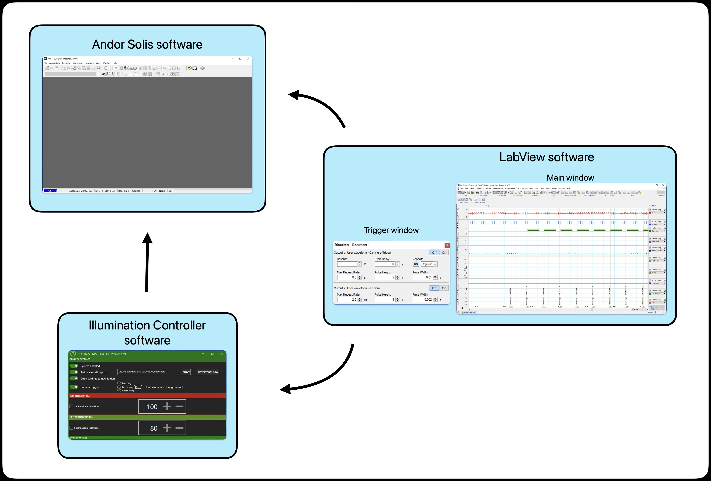
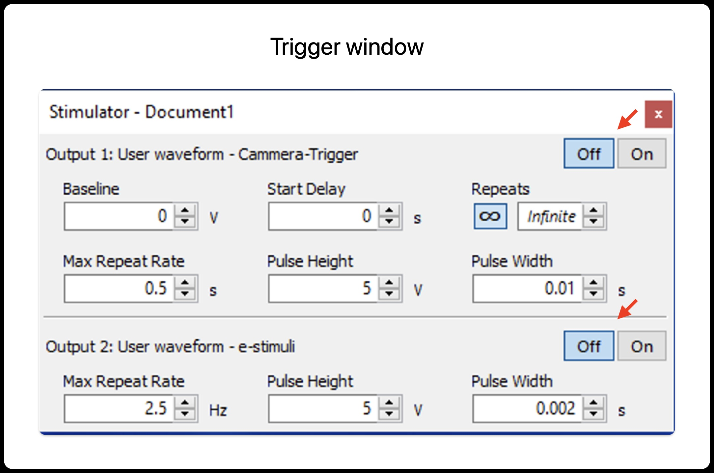
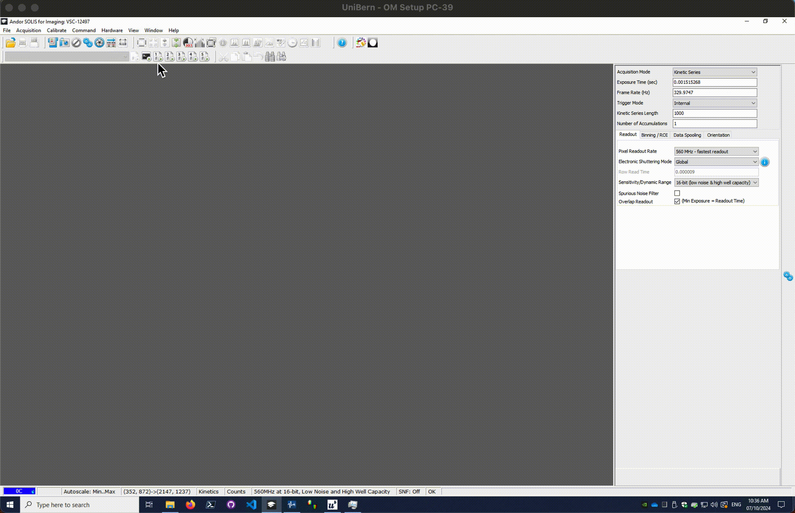

```{admonition} Note
:class: note
for us:
These is a list of ideas for a starting an acquisition I would like to add.
- [x] Get to know the acquisition workflow
- [ ] adjusting the camera configuration
- [x] adjusting the PowerLab configuration
- [ ] adjusting the pacer configuration
- [ ] other?
```


# Example acquisition

Before you start, make sure you have initiated the setup as describe in the [Starting the set-up](./experiment.md) tutorial.

<br>Here is an schematics on how the acquisition workflows works in a regular setting:



<br>The LabView is configured to trigger the camera on and pacer via the trigger window. There are two trigger options: the camera trigger (upper one) and the e-stimuli trigger (lower one). Turning on the trigger will send the signal to each device respectively. See bellow the example for details.




<br>In this example the trigger will send a "free run" signal to the camera every 0.5 s (2 Hz).
<br>Similarly, the trigger will send a signal to the e-estimulator at 2.5 Hz (every 400 ms). In orther to use this option, make sure that the pacer has been configured to mode: *TRIGGERED*.
<br>Note that the pacer when operated in this way, the external e-stimuli trigger only control the frequency of the signal. Pay attention that no amplitude of the e-pacer is controlled via the LabView/PowerLab. In orther to change the voltage apmplitude of the stimuli you must set it manually on the e-pacer apparatus.

```{admonition} Attention!
:class: warn
The e-stimuli trigger does not control the amplitude (voltage) of the signal only the frequency!.
```
<br>Now lets have a look at the configuration of the camera to receive the triggering signal.

If you have previously loaded  a configuration file, you will find a number of macros availables as display bellow.
Those are needed to facilitate the acquisiton via external triggering.




{{under_construction_warn}}