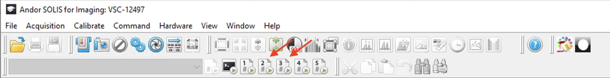
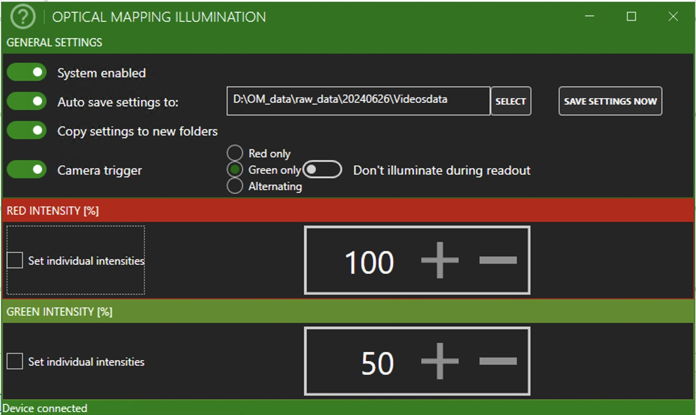

```{admonition} Note
:class: note
For us:
These is a list of ideas for setting up experiments I would like to add.
- [x] turninng on hardware 
- [x] launching controlling software
- [x] calibrating pressure transducer(s)
- [ ] other?
```
The following tutorial describe how to setup the optical mapping equipment to start a new acquisition.
The guidelines provided here are specific for our lab at the Translational Cardiology/Electrophysiology research group, Univeristy of Bern.

# Starting the set-up 

## 1. Turning on devices:

- Computer Pc39

- PowerLab (switch behind the device)

- Camera (switch behind the device) wait for beep after switching on and remove the lens cap.

- Pacer (switch behind the device) wait for beep after switching on.

## 2. Launch the controller/monitoring programs:


### **Andor Solis**

The *Andor Solis* software is the program that control the camera and its configuration. Before you begin your caquisition is recommended that you load a configuration file which contain all settings and macros to semi-automate the acquisition.

- Load the configuration file at: File -> Configuration File -> Load ... <br>The file is located at the disk D from Pc39: <br>`D:\Ruben\OneDrive - Universitaet Bern\Bern\Odening_lab\OMAAS\setup_files\config_files_ANDOR_Camera\PanoramicConfig_4View - conf_file.cfg`<br>

- Create the experiment folders: after you load the configuration file, use the program (macro) button #2 or #3 as show bellow: 
<br>
<br><br>
<br>
This will cretae a new image and create folders for the experiment with the current date (YYYYMMDD) at the the following location:
    ```
    Pc39
        └── D:/
            └── OM_data/
                └── raw_data/
                    └── YYYYMMDD/
                        ├── Powerlab_data
                        └── Videosdata
    ```
New images will be automatically stored under the directory Videosdata.


### **LabChart**

The *LabChart* or *LabView* is the main software to monitor, acquire and integrate all signals e.g. ECG, camera, pressure transducers, pacer, etc. Before you start an acquisition, it is recommended to load a configuration file with predefined settings. Here are the steps to load a configuration file.

- if not present, launch the Welcome center

- Load the configuration file listed at the left pannel called:<br>
`OM_settings2`<br> <br>
If it does not pop up at the welcome center, you can located at the following path:<br><br>
`D:\Ruben\OneDrive - Universitaet Bern\Bern\Odening_lab\OMAAS\setup_files\PowerLab_conf_files\OM_settings2.adiset`

- save the file under the folder `Powerlab_data` previously created  and rename it with the current day.

### **Optical Mapping Illumination**

The *Optical Mapping Illumination* software allows to control and sync the  illumination LEDs system with the camera during acquisiton or testing. Here are the steps to start and configure it for acquisition:

- Launch the latest version of the *Optical Mapping Illumination* software.

- Make sure that the following configurations are <u>**on**</u>:<br>
    1. System enabled
    2. Auto save setting to:
    3. Copy settings to new folders
    4. Camera trigger

- Change the Auto save setting to: path to the current folder Videosdata. Bellow an examle onhow it normally looks like.
<br>
<br><br>
<br>
- Change accordingly if you whish to use Red, Blue or Alternating illumination.

### **Picoscope**

If you wish to monitor the ECG, pacing or any other signal in real time (highly recommended) you can launch the *Picoscope* to visulaize what is happening with your experiment.

### **napari-omaas**

The *napari-omaas* application is handy for a fast visulaization of .sif or spooled images collected with the Andor camera.<br>
To launch the napari-omaas application find the shortcut at the Desktop of Pc39 and double clik on it. This will start the application.


## 3. Calibrate pressure transducers

```{admonition} Note
:class: note
for me:
may be add couple of screenshots here
```

Make sure you calibrate the pressure transducer from the set-up.

- on the Powerlab, start sampling and check at the channels corresponding to the Aortic pressure or the balloon pressure (in case you are also using the intraventricular balloon).

- purge the lines with destilled water and insert the manometer from one side and black all other inlets of the probe.

- apply a known pressure (e.g 120 mmHg) using the manometer for about 5~10 s and then release to reach the cero (atmospheric pressure). Stop recording.

- on the LabView, go to the channel where you are doing the calibration and select the region where you have the high and low. Right clik on the left side of the channel pannel and go to -> units conversion?

- introduce the high and low pressure levels and wirte the actual pressure values accordingly. Click accept.

After this, calibration should be finish. You can always confirm if the caibration was succesful by double checking the readings with the manometer.


{{under_construction_warn}}